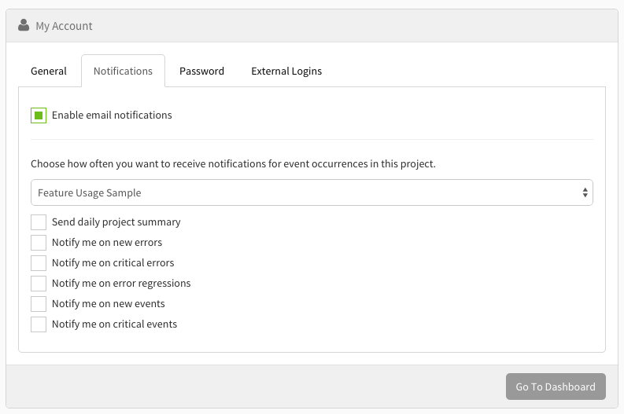

# Notifications

To turn on email notifications, go to "My Account" in your dashboard, then click on the "Notifications" tab.

Once you're in there, you can select the project you want to edit notifications to, and then select which notifications you want to receive for that selected project.

---

[Next > Log Levels](/docs/setting-log-levels)
