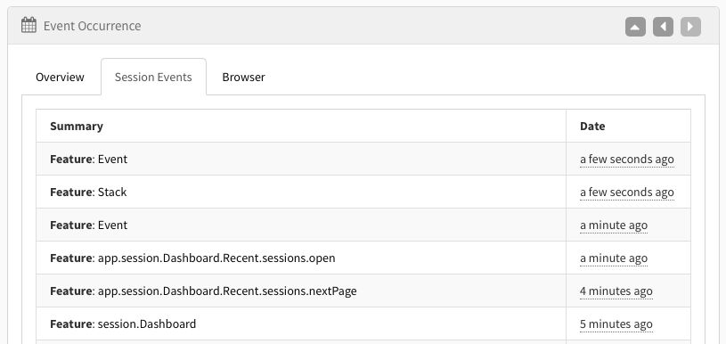
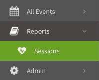

# User Sessions

With user session tracking, you can easily see what a user is doing that leads up to an event occurrence, or just see how they are using your app.

Each session has a list of events (feature usages, exceptions, log messages, etc) that the user triggered. Each can be clicked on to drill down.



Browser and environment information, along with any other data that persists throughout the user session is stored as well.

Once you set up session tracking, you can find the report under Reports > Sessions, or click on the unique session id in any event's overview tab.



## Turn On Session Tracking

Set a default user identity via the following client methods to send the user ID for each event. Once set, it will be applied for all future events.

### C# Set User Identity Example

```csharp
using Exceptionless;
ExceptionlessClient.Default.Configuration.SetUserIdentity("UNIQUE_ID_OR_EMAIL_ADDRESS", "Display Name");
```

### JavaScript Set User Identity Example

```javascript
exceptionless.ExceptionlessClient.default.config.setUserIdentity('UNIQUE_ID_OR_EMAIL_ADDRESS', 'Display Name');
```

**Please Note: In WinForms and WPF applications**, a plugin will automatically set the default user to the `Environment.UserName` if the default user hasn’t been already set. Likewise, if you are in a web environment, we will set the default user to the request principal’s identity if the default user hasn’t already been set.

**If you are using WinForms, WPF, or a Browser App**, you can enable sessions by calling the `UseSessions` extension method.

### C# Use Sessions Example

```csharp
using Exceptionless;
ExceptionlessClient.Default.Configuration.UseSessions();
```

### JavaScript Use Sessions Example

```javascript
exceptionless.ExceptionlessClient.default.config.useSessions();
```

## Manually Send SessionStart, SessionEnd, and heartbeat Events

You can use our client API to start, update, or end a session. Just remember, a user identity must be set.

### C# Submit Session Events Example

```csharp
using Exceptionless;
ExceptionlessClient.Default.SubmitSessionStart();
await ExceptionlessClient.Default.SubmitSessionHeartbeatAsync();
await ExceptionlessClient.Default.SubmitSessionEndAsync();
```

### JavaScript Submit Session Events Example

```javascript
exceptionless.ExceptionlessClient.default.submitSessionStart();
exceptionless.ExceptionlessClient.default.submitSessionHeartbeat();
exceptionless.ExceptionlessClient.default.submitSessionEnd();
```

## Disable Heartbeat

If you would like to disable the near real-time session tracking heartbeat that goes out ever 30 seconds, you can pass `false` as an argument to the `UseSessions()` method.

---

[Next > Notifications](/docs/notifications)
